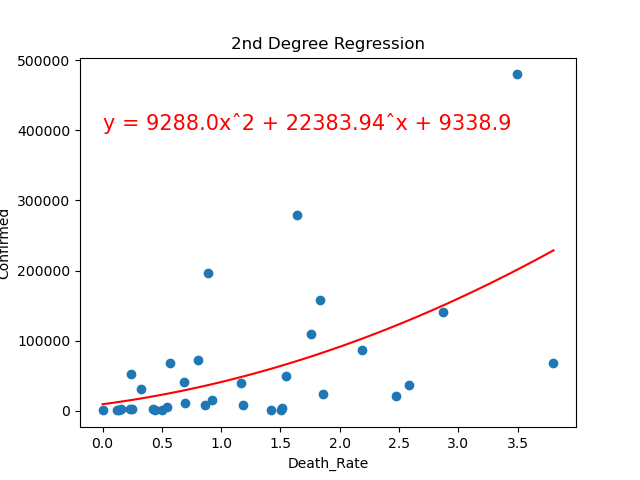
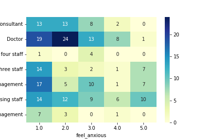
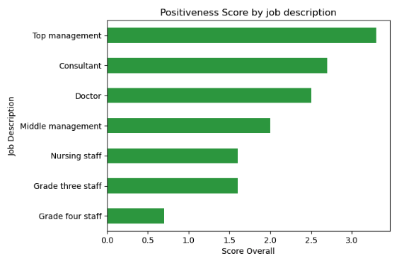
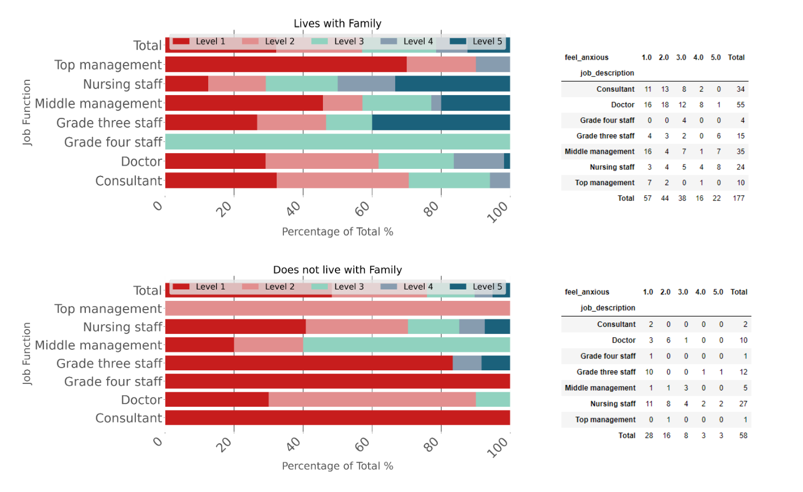
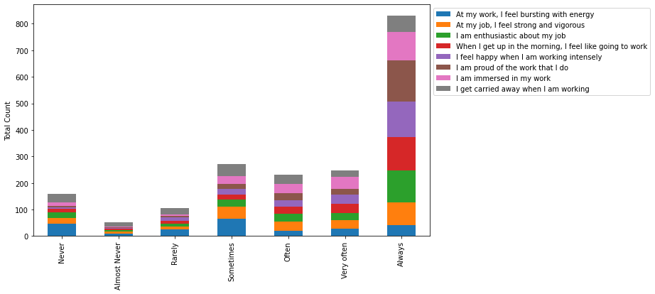
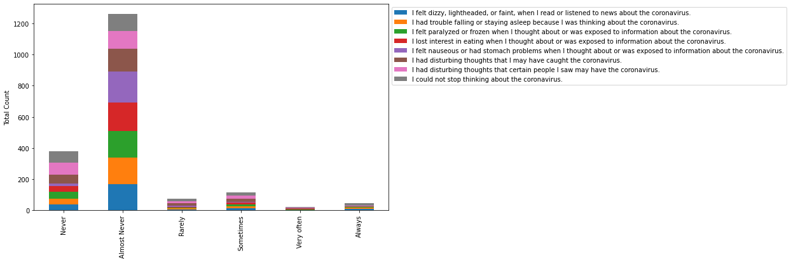
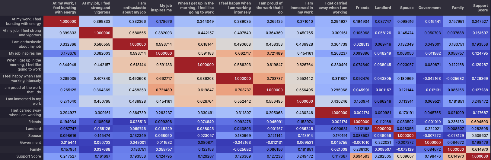
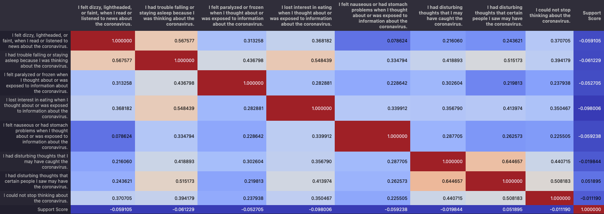

# The Impact of Covid-19 on Well-being of Healthcare Professionals in India

### Description
A basic analysis of the well-being of healthcare professionals in India during the covid-19 lockdown, and the direct effect of the number of covid cases, recoveries, and deaths. The source of the data is from kaggle: [source 1](https://www.kaggle.com/datasets/shashwatwork/wellbeing-of-healthcare-professionals-in-india) | [source 2](https://www.kaggle.com/datasets/imdevskp/covid19-corona-virus-india-dataset)

### Info / Credits

- Analysis by
   * `Kolton Xie` [@kottonxie](https://github.com/kottonxie)
   * `João Pedro Fortunato` [@joaopedrofortunato](https://github.com/joaopedrofortunato)
   * `Nicholas Wetherell` [@LaikaBoss10](https://github.com/LaikaBoss10)
   * `Alex Storton` [@astorton](https://github.com/astorton)
   * `Bryan Tsan-Tang` [@bryan-tt](https://github.com/bryan-tt)

- `REPO:` https://github.com/joaopedrofortunato/ucb_project_1_group_6

- `Analysis Last Updated:` April 20th, 2023

- `Report Last Updated:` April 20th, 2023

### Data Sources
|Name|Type|Description|Website|
|---|---|---|---|
|Well-being of Healthcare Professionals in India|Dataset|Examine the effect of COVID-19 anxiety, obsession with COVID-19, and work engagement on mental health at work among employed Indian healthcare professionals.|https://www.kaggle.com/datasets/shashwatwork/wellbeing-of-healthcare-professionals-in-india|
|COVID-19 Corona Virus India Dataset|Dataset|Time series analysis on the confirmed covid cases, recoveries, and deaths in India.|https://www.kaggle.com/datasets/imdevskp/covid19-corona-virus-india-dataset|

## Table of Contents
- Introduction
   * Purpose?
- About the Data
- ETL Process
   * Data cleaning
   * Data transformation
- Hypothesis Questions
- Analysis
   * How do Healthcare workers feel about their jobs by geolocation?
   * Is there a correlation between job function and anxiousness?
   * Has family vs. no family specific analysis
   * Correlation between close contact (proximity) with patients and anxiousness
   * Is there a correlation between relationships and support for work life?
- Conclusion

## Introduction
Hi. We are Nicholas, João Pedro, Alex, Kolton, and Bryan, and we are (at the time this report was written) students at the University of California Berkeley's Data Analytics Bootcamp. In the last 8 weeks, we have learned skills in `Excel`, `VBA`, `Python`, `Pandas`, `Matplotlib` and `accessing APIs`. In this analysis, we utilized the knowledge we obtained on Python, Pandas, Matplotlib, and accessing APIs to perform a basic analysis on data on the well-being of healthcare professionals in India during the covid-19 lockdown.
### Purpose?
We chose the impact COVID had on Healthcare Workers in India because we wanted to see the impact of COVID beyond the United States and to see if there was a correlation between COVID cases and mental health.
## About the Data
Our analysis was performed using two, unique COVID-19 datasets specific to the country of India. The healthcare professionals survey served as our primary dataset which all of our hypotheses were derived from. The questionnaire was completed by 237 respondents and bound to the month of June, 2020. The purpose of the survey was to examine the effect of COVID-19 on a variety of mental health factors and demographics which may affect COVID-19 anxiety and overall work engagement levels.

This data set included a rich combination of categorical, Likert scale and demographic data. Rounding this out were a few binary, multi-select and free-hand responses.

The COVID-19 cases dataset provides a series of macro-level data points specific to confirmed covid cases, deaths, medically cured and discharge rates and recovery counts. Key demographics include region/state and geolocation. All data collected was dated and ranged from January 29th to August 5th, 2020. 

Both datasets were determined to be highly usable and relevant to our project. 

## ETL Process
### Data Cleaning
Most of the data cleaning was done on the dataset: Well-being of Healthcare Professionals in India. Other than the standard data cleaning procedures, such as dropping unnecessary columns and removing null values, a couple of techniques that stood out were using the special encoding cp1252, and breaking down “Select all that apply” style questions into dataframes of dummy variables.
### Data Transformation
We were able to do some feature engineering by first grouping the questions into two main categories: positive and negative. From here, we were able to aggregate the surveyee answers and create an overall “feeling” score.  [Positiveness Score = Positive Emotions (average) - Negative Emotions (average)]
## Analysis
### How do Healthcare workers feel about their jobs by geolocation?
We found a few interesting results in this section:
#### Confirmed Cases vs Death Rate
The higher the number of cases, even higher the Death Rate

#### Positiveness Score
In general, the responders feel positive about their jobs (Positiveness Score = 2.1)
#### Positiveness Score vs Deaths
The correlation between the number of deaths and how HCW feel about their jobs  is technically null (r_test = 0.0002)

#### Positiveness Score vs Death Rate
The correlation between the Death Rate and how HCW feel about their jobs  is high (r_value =  0.52).

### Is there a correlation between job function and anxiousness?
The question itself is very straightforward; however, our expectation was that those on the floor had higher levels of anxiety compared to those in an administrative role. The first thing we did was to test if these two categorical variables were correlated. To do this, we used the chi-square test.

**Ho:**: There is no association between the two categorical variables.

**Ha:** There is an association between the two categorical variables.

Since the chi-square value of 59.66 exceeds the critical value of 36.42, we can reject the null hypothesis. We can conclude that the results are statistically significant. There is an association between job function and the level of anxiety.

To take this question further, we used the overall feeling score that was created and grouped by job function to see which job functions felt the most positive. We found that compared to their superiors, the operational staff tended to harbor less positive feelings during the covid 19 lockdown.

### Anxiety level comparative analysis between those that live with family vs. those that do not. 
An additional analysis of anxiety level by job function included comparing respondents who said they lived with family and those that did not. The purpose of this sub-analysis was to examine the percentage of total anxiety level by job function and determine if there was any statistical significance in the sampling. 

Our assumption was that living with family would positively affect a medical professional’s anxiety level considering the added risks of transmitting COVID back home - or vice versa - back to the hospital where vulnerable patients and/or staff operate.

Hypothesis:
-Null-Hypothesis:Anxiety level does not increase if living with family
-Alternate Hypothesis:Anxiety level does increases if living with family

Sampling:
Group 1 = Living with family
Group 2 = Not living with family

We performed an independent sampling t-test comparing the two groups.

t-Test Results: 
statistic = 1.534
p-value = 0.174

Conclusion: The p-value is greater than .05; therefore we can’t reject the Null Hypothesis

Additional insights can be found in the image below

### Is there a correlation between close contact (proximity) with patients and anxiousness?

This question is analyzed via two visualizations. A heat map and a stacked bar chart. The scripts used to produce these figures are included in ucb_project_1_group_6/nw_notebook/nw_notebook.ipynb. The heat map reveals the greatest density of respondents at low anxiety levels and low patient contact. The stacked bar chart is used to visualize the anxiety level breakdowns for each level of patient contact. An important takeaway from this figure is that the proportion of survey respondents that reported a high contact with patients reported low anxiety more frequently than those who reported a lower level of contact with patients. This evidence rejects our hypothesis that greater amounts of patient contact will result in higher levels of worker anxiety.

### Is there a correlation between relationships and support for work life?

Diving more into the data, we wanted to identify if there is a correlation between those who felt supported by their relationship (such as friends, government, etc) have more positive feelings toward their work.

Due to the nature of the survey, we encountered a lot of Likert Scale questions which usually are composed of a series of four or more items. 

For example,
- Strongly Disagree
- Disagree
- Neither agree nor disagree
- Agree
- Strongly Agree

In order to easily work with the data and make it easier, we transformed the data into an integer value that represents the items.

For example, 
- Strongly Disagree = -2
- Disagree = -1
- Neither agree nor disagree = 0
- Agree = 1
- Strongly Agree = 2

Exploring the data, we wanted to identify any immediate observations.

Instantly, we can immediately identify an overwhelmingly positive perspective toward their work with questions.

However, is there a correlation between how they felt about work and the support for work life?

To calculate the support, we used Bryan’s data cleaning process: Dummy Variables, to create a binary column of 1s and 0s. Then, summing the values by row, we receive a “support score”.

To compare the support score and the questions conducted, we utilized a correlation matrix, a table that shows the correlation coefficients between pairs of variables in a dataset. We were able to conclude that, generally, there was a positive correlation between the support score and a negative correlation compared to the support score.

However, due to the values not being close to 1 or -1, the conclusion is not statistically significant enough to say that more support led to a positive perspective toward work.

### Data Challenges

Limited Data: 
The size of a sample is important because it influences the precision of estimates and the power of a study to draw conclusions. Because our sample is small, it may prevent the findings from being representative of the population.

Likert Scales Distortion: 
Likert scale questions are subjected to distortion from several causes, such as...central tendency bias, presented acquiescence bias, and social desirability bias.

Likert Transformation:
In the case of our data, since the Likert scale data were strings, we pivoted the data in order for us to better utilize the data. We transformed the data into numeric values to create a sum score for each type of question(s), such as positive vs. negative ones.

## Conclusion
The analysis performed helped lend us insights into the correlation across a multitude of categorical and demographic data and their respective statistical significance. Above all else, helping shed light on an often overlooked aspect of any outbreak and the mental health of our medical professionals who operate at the front line of the pandemic. 

Additional considerations are above and beyond the scope of the assignment. This included both examinations of how key economic factors play into mental health in response to the COVID-19 pandemic and the statistical biases underpinning the analysis. 

Additional considerations include enabling users to enter their desired variables and demographic slicers based on a list provided. Inputs would then be computed by the Python engine to produce a visualization, data table and summary statistics to help inform the insights requested by the user. 
